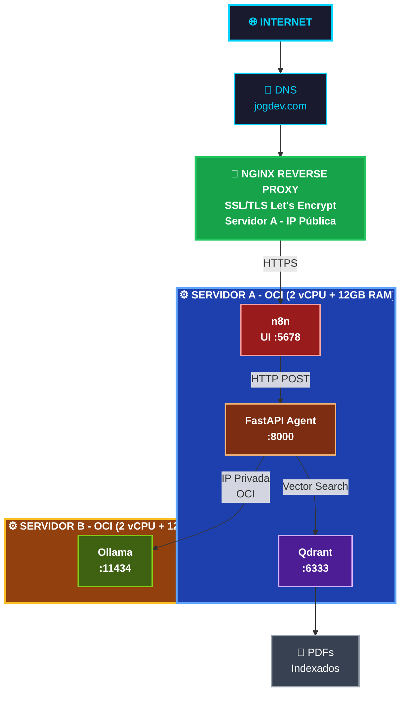
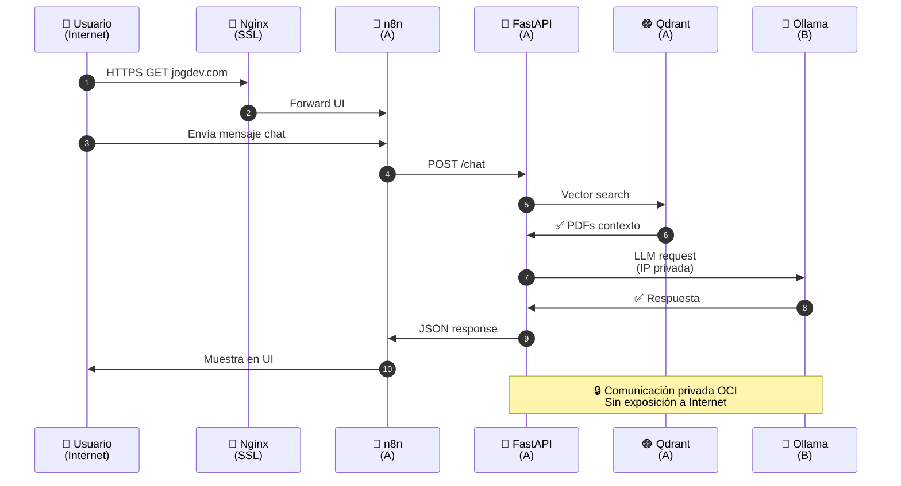
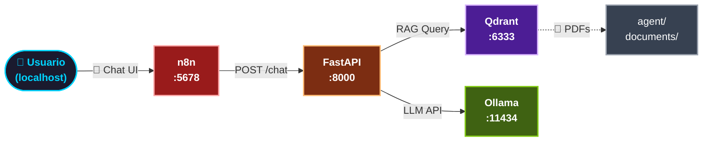

# IA Challenge — Asistente RAG con n8n, Python y Ollama


---

## 🚀 **Demostración en producción**

### **Acceso en vivo: [www.jogdev.com](https://www.jogdev.com)**

Esta plataforma está **desplegada en Oracle Cloud Infrastructure (OCI)** con una arquitectura distribuida en **dos servidores de alto rendimiento**:

| Componente | Especificaciones | Rol |
|-----------|------------------|-----|
| **🖥️ Servidor A** | 2 vCPU + 12 GB RAM (OCI) | **n8n** (Chat UI) + **Qdrant** (Vector DB) en Docker |
| **🖥️ Servidor B** | 2 vCPU + 12 GB RAM (OCI) | **Ollama** (LLM local `llama3.1:8b`) en Docker |
| **🌐 Dominio** | jogdev.com | IP pública del Servidor A con Nginx SSL/TLS |
| **🔗 Red** | VPC privada OCI | Comunicación interna segura entre servidores |

---

## 📊 **Arquitectura de producción en OCI**



---

## **Flujo de una consulta de usuario (end-to-end)**



---

## 📋 **Requisitos previos**

| Requisito | Versión mínima recomendada | Notas |
|-----------|---------------------------|-------|
| [Docker](https://docs.docker.com/get-docker/) | 24+ | Con soporte Compose v2 |
| [Docker Compose](https://docs.docker.com/compose/) | v2+ | Incluido en Docker Desktop |
| [Git](https://git-scm.com/) | 2.x | Para clonar el repositorio |
| RAM | 8 GB+ | El modelo Ollama ocupa ~4–5 GB |
| Disco libre | ~10 GB | Modelo + imágenes Docker + índice ChromaDB |

> **Windows/macOS:** instala [Docker Desktop](https://www.docker.com/products/docker-desktop/) y asegúrate de que el daemon esté en ejecución antes de continuar.

---

## 💻 **Instalación**

### 1. Clonar el repositorio

```bash
git clone https://github.com/Jefer1026/ia-challenge.git
cd ia-challenge
```

### 2. Variables de entorno

**No se requiere archivo `.env`.** Toda la configuración está definida en `docker-compose.yml`:

| Servicio | Variables relevantes |
|----------|---------------------|
| **n8n** | `N8N_HOST`, `N8N_PORT`, `N8N_PROTOCOL`, `WEBHOOK_URL`, `N8N_DEFAULT_FLOWS_PATH` |
| **ollama** | `OLLAMA_HOST=0.0.0.0` |
| **qdrant** | `QDRANT_API_KEY` (opcional), puerto `6333` |
| **python-agent** | Sin variables externas; conecta a Ollama vía `http://ollama:11434` |

Si necesitas personalizar puertos o URLs, edita directamente `docker-compose.yml`.

### 3. Estructura del proyecto

```
ia-challenge/
├── agent/                  # Agente Python (FastAPI + RAG)
│   ├── agent.py
│   ├── Dockerfile
│   ├── requirements.txt
│   ├── documents/          # PDFs indexados al arrancar (ej. lumina_store.pdf)
│   └── chroma_db/          # Índice vectorial persistente
├── n8n/
│   ├── init-ollama.sh      # Arranque de Ollama + descarga del modelo
│   └── ollama_data/        # Modelos Ollama (persistente, en .gitignore)
├── workflows/
│   └── challenge.json      # Workflow n8n (Chat → HTTP → python-agent)
├── .n8n/n8n_data/          # Base de datos y datos de n8n (persistente)
└── docker-compose.yml
```

---

## 🏃 **Puesta en marcha**

Desde la raíz del proyecto:

```bash
docker compose up -d --build
```

| Servicio | Puerto host | URL / endpoint |
|----------|-------------|----------------|
| n8n | `5678` | http://localhost:5678 |
| python-agent | `8000` | http://localhost:8000 |
| ollama | `11434` | http://localhost:11434 |
| qdrant | `6333` | http://localhost:6333 |

Verifica que los cuatro contenedores estén activos:

```bash
docker compose ps
```

---

## ⚠️ **Inicialización de n8n (importante)**

En el **primer acceso** a http://localhost:5678, n8n solicitará crear una **cuenta de propietario (owner)**. Este paso **inicializa la base de datos SQLite** en `.n8n/n8n_data/` (`database.sqlite`).

- **No elimnes** la carpeta `.n8n/n8n_data/` una vez configurada: perderás credenciales, workflows y claves de cifrado.
- Si el contenedor se reinicia antes de completar el registro, espera a que n8n termine de escribir la BD antes de volver a acceder.
- Tras el registro, **importa y activa** el workflow `workflows/challenge.json`:
  1. En n8n: **Workflows → Import from File** (o arrastra el JSON).
  2. Abre el workflow **challenge** y pulsa **Activate** (viene con `"active": false`).

> La primera ejecución de **Ollama** puede tardar varios minutos mientras descarga `llama3.1:8b-instruct-q4_K_M`. Revisa los logs: `docker compose logs -f ollama`.

---

## 📚 **Guía de uso básico**

### n8n (interfaz de chat)

1. Accede a http://localhost:5678 e inicia sesión.
2. Importa y activa `workflows/challenge.json`.
3. Abre el workflow **challenge** y usa el nodo **Chat Trigger** para probar mensajes.
4. El flujo envía cada mensaje a `POST http://python-agent:8000/chat` con el cuerpo `{ "message": "<texto>" }`.

### Agente Python (API directa)

**Chat:**

```bash
curl -X POST http://localhost:8000/chat \
  -H "Content-Type: application/json" \
  -d '{"message": "¿Cuáles son las políticas de la tienda Lumina?"}'
```

Respuesta esperada:

```json
{ "response": "..." }
```

**Subir un PDF adicional:**

```bash
curl -X POST http://localhost:8000/upload \
  -F "file=@./agent/documents/mi_documento.pdf"
```

Al arrancar, el agente escanea automáticamente `agent/documents/*.pdf` y los indexa en ChromaDB/Qdrant.

**Documentación interactiva:** http://localhost:8000/docs

### Ollama

```bash
# Listar modelos instalados
curl http://localhost:11434/api/tags

# Ver logs de descarga / arranque
docker compose logs -f ollama
```

El script `n8n/init-ollama.sh` inicia `ollama serve` y descarga el modelo si no existe localmente.

---

## 🏗️ **Arquitectura (localhost)**

Todos los servicios comparten la red Docker **`ai-network`** (driver `bridge`).



| Componente | Rol |
|------------|-----|
| **n8n** | Recibe mensajes del chat y los reenvía al agente vía HTTP Request |
| **python-agent** | FastAPI: indexa PDFs, recupera contexto (RAG) y genera respuestas con historial |
| **Qdrant** | Almacén vectorial distribuido (alternativa a ChromaDB) |
| **Ollama** | Servidor LLM local con `llama3.1:8b-instruct-q4_K_M` |

Flujo de una pregunta:

1. Usuario escribe en el chat de n8n.
2. n8n llama a `http://python-agent:8000/chat`.
3. Si el mensaje tiene ≥ 20 caracteres, el agente busca contexto relevante en Qdrant.
4. El agente envía el prompt (con contexto opcional) a Ollama.
5. La respuesta JSON vuelve a n8n y se muestra al usuario.

---

## 🔧 **Solución de problemas**

### Permisos de Docker

```bash
# Linux: añadir tu usuario al grupo docker
sudo usermod -aG docker $USER
# Cierra sesión y vuelve a entrar
```

En Windows, ejecuta Docker Desktop como administrador si hay errores de volumen.

### Puertos ocupados

| Puerto | Servicio |
|--------|----------|
| 5678 | n8n |
| 8000 | python-agent |
| 11434 | ollama |
| 6333 | qdrant |

```bash
# Windows (PowerShell)
netstat -ano | findstr :5678

# Linux/macOS
lsof -i :5678
```

Cambia el mapeo en `docker-compose.yml` (ej. `"5679:5678"`) si hay conflicto.

### Contenedores no arrancan

```bash
docker compose ps
docker compose logs n8n
docker compose logs python-agent
docker compose logs ollama
docker compose logs qdrant
```

Reconstruir desde cero:

```bash
docker compose down
docker compose up -d --build
```

### Ollama: modelo no disponible

- Primera ejecución: espera la descarga (`docker compose logs -f ollama`).
- Verifica: `curl http://localhost:11434/api/tags` debe listar `llama3.1:8b-instruct-q4_K_M`.

### Agente no responde / error de conexión a Ollama

El agente usa el hostname interno `ollama` (no `localhost`) dentro de la red Docker:

```python
client = ollama.Client(host='http://ollama:11434')
```

Asegúrate de que `python-agent` tenga `depends_on: ollama` y que ambos estén en `ai-network`.

### Qdrant no responde

- Verifica que Qdrant esté escuchando: `curl http://localhost:6333/health`
- Logs: `docker compose logs -f qdrant`
- URL interna en Docker: `http://qdrant:6333`

### n8n: workflow sin respuesta

- Confirma que el workflow está **activado**.
- La URL interna debe ser `http://python-agent:8000/chat` (nombre del servicio Compose, no `localhost`).
- Prueba el agente directamente con `curl` antes de depurar n8n.

### ChromaDB / PDFs no indexados

- Coloca PDFs en `agent/documents/`.
- Reinicia el agente: `docker compose restart python-agent`.
- O sube vía `POST /upload`.

---

## 📡 **Comandos útiles**

```bash
# Detener servicios
docker compose down

# Detener y eliminar volúmenes (⚠️ borra datos de n8n si eliminas .n8n/n8n_data)
docker compose down -v

# Rebuild solo del agente
docker compose up -d --build python-agent

# Rebuild solo de Qdrant
docker compose up -d --build qdrant

# Seguir logs en tiempo real
docker compose logs -f

# Logs específicos
docker compose logs -f python-agent
docker compose logs -f ollama
docker compose logs -f qdrant
```

---

## 🌐 **Despliegue en OCI (Producción)**

Para replicar la arquitectura de producción en Oracle Cloud Infrastructure:

### **Configuración de servidores**

1. **Crear dos instancias Compute (OCI)**
   - Imagen: Ubuntu 22.04 (o CentOS 8)
   - Forma: Standard 2.1 (2 vCPU, 12 GB RAM)
   - Red: Misma VPC para comunicación privada

2. **Servidor A - n8n + Qdrant**
   ```bash
   # Instalar Docker y Docker Compose
   sudo apt update && sudo apt install -y docker.io docker-compose git
   sudo usermod -aG docker $USER
   
   # Clonar y desplegar
   git clone https://github.com/Jefer1026/ia-challenge.git
   cd ia-challenge
   docker compose up -d --build
   ```

3. **Servidor B - Ollama**
   ```bash
   # Instalar Docker
   sudo apt update && sudo apt install -y docker.io
   sudo usermod -aG docker $USER
   
   # Descargar e iniciar Ollama
   docker pull ollama/ollama
   docker run -d -p 11434:11434 -v ollama:/root/.ollama ollama/ollama
   docker exec <container_id> ollama pull llama3.1:8b-instruct-q4_K_M
   ```

4. **Configurar networking**
   - Obtén la **IP privada** del Servidor B
   - En Servidor A, actualiza `docker-compose.yml`:
     ```yaml
     environment:
       OLLAMA_HOST: http://<PRIVATE_IP_SERVIDOR_B>:11434
     ```

5. **SSL/TLS con Let's Encrypt (Nginx en Servidor A)**
   ```bash
   # Instalar Nginx
   sudo apt install -y nginx certbot python3-certbot-nginx
   
   # Obtener certificado
   sudo certbot certonly --dns-cloudflare -d jogdev.com
   
   # Configurar Nginx como reverse proxy
   sudo nano /etc/nginx/sites-available/jogdev.com
   ```
   
   **Config Nginx:**
   ```nginx
   upstream n8n {
       server localhost:5678;
   }
   
   server {
       listen 443 ssl http2;
       server_name jogdev.com;
       
       ssl_certificate /etc/letsencrypt/live/jogdev.com/fullchain.pem;
       ssl_certificate_key /etc/letsencrypt/live/jogdev.com/privkey.pem;
       
       location / {
           proxy_pass http://n8n;
           proxy_set_header Host $host;
           proxy_set_header X-Real-IP $remote_addr;
           proxy_set_header X-Forwarded-For $proxy_add_x_forwarded_for;
           proxy_set_header X-Forwarded-Proto $scheme;
       }
   }
   
   server {
       listen 80;
       server_name jogdev.com;
       return 301 https://$server_name$request_uri;
   }
   ```

6. **Security Groups (OCI)**
   - Servidor A:
     - Puerto 22 (SSH): desde tu IP
     - Puerto 80 (HTTP): desde 0.0.0.0
     - Puerto 443 (HTTPS): desde 0.0.0.0
   - Servidor B:
     - Puerto 22 (SSH): desde Servidor A
     - Puerto 11434 (Ollama): desde IP privada de Servidor A

---

## 📄 **Licencia**

Este proyecto está licenciado bajo la [MIT License](LICENSE).

SPDX-License-Identifier: MIT
